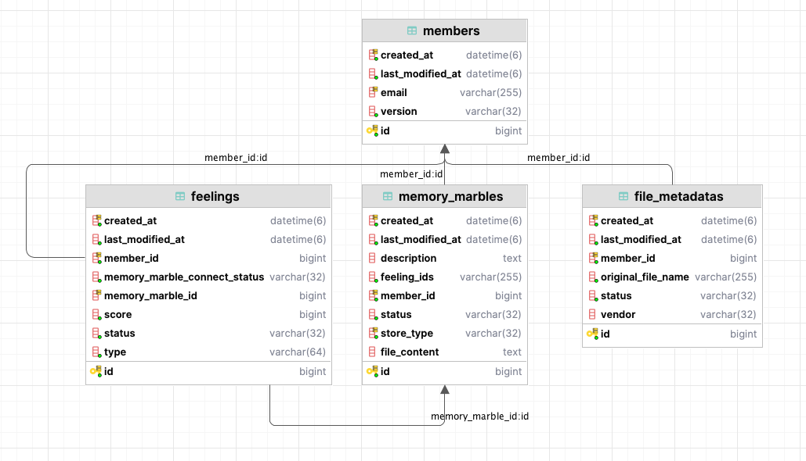
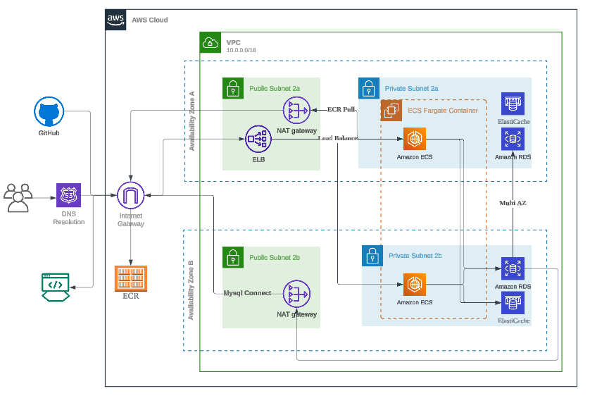

# 📅 Insideout: 오늘 있었던 일의 감정을 작성하고 기억구슬을 저장하는 서비스입니다.

 

## 🌟 1. ERD

- members: 회원 테이블
- feelings: 감정 테이블
- memory_marbles: 기억 구슬 테이블
- idempotency_keys: 요청에 대한 멱등성 관리 테이블

 

## 📜 2. Architecture

 

## 📹 3. Infra

## 📆 4. 개발 기간
- 2024.06.21 ~ 

 

## 📹 5. 테스트 API

