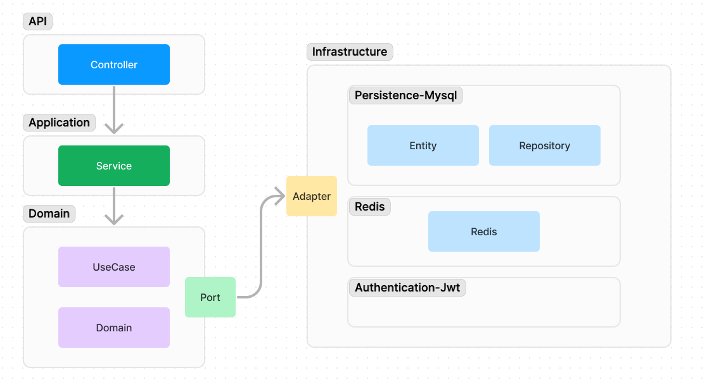

# 📅 Insideout

- 오늘 있었던 일의 기분을 기록 해서 기억구슬을 만들고 관리하는 서비스입니다.

 

## 🌟 1. ERD

- members: 회원 테이블
- feelings: 감정 테이블
- memory_marbles: 기억 구슬 테이블
  - file_content: file_metadata의 id, fileName을 json으로 구성
- file_metadatas: 첨부파일

 

## 📜 2. layer Architecture

 

## 📹 3. Infra

## 📆 4. 개발 기간

- 2024.06.21 ~

 

## 📹 5. 개발 소개
- Spring Batch Partition 단위로 병렬 처리하기 (https://gose-kose.tistory.com/145)
- 외부 스토리지를 활용하여 첨부파일 관리하기 (https://gose-kose.tistory.com/146)